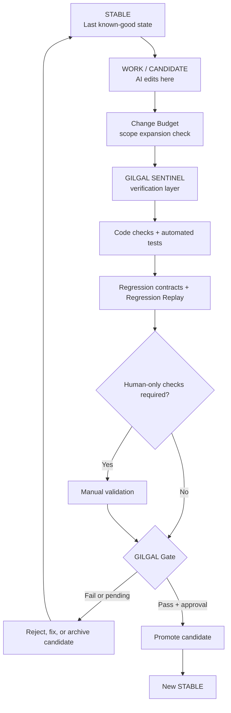

# GILGAL

**Guarded Iterative Layer for Generative Agent Logic**

A safety workflow for AI coding agents: **never destroy the last known-good version while trying to create the next one.**

> **Core rule:** STABLE is never the laboratory. WORK is the laboratory.

**Concept documented by:** David Ferreira ([@crentefiel](https://github.com/crentefiel))  
**First public specification:** 2026-08-25  
**Current concept version:** 0.3.0

---

## Português

O **GILGAL** é um protocolo de trabalho para agentes de IA que programam software.

A ideia central é manter o último estado comprovadamente bom protegido enquanto a IA trabalha em um candidato isolado.

- **STABLE** — última versão comprovadamente funcional.
- **WORK / CANDIDATE** — ambiente onde a IA pode editar, experimentar e corrigir.
- **SENTINEL** — reúne evidências, executa verificações e procura regressões.
- **GATE** — bloqueia promoção quando os requisitos não foram comprovados.

A IA nunca deve usar STABLE como laboratório.

```text
STABLE
  │
  ├── cria CANDIDATE / WORK
  │
  ▼
WORK
  │
  ├── alterações
  ├── diff
  ├── Change Budget
  ├── typecheck / testes / build
  ├── contratos
  ├── Regression Replay
  └── testes humanos quando necessários
  │
  ▼
GILGAL SENTINEL
  │
  ├── verifica código
  ├── executa/consome testes
  ├── compara STABLE x CANDIDATE
  ├── repete regressões conhecidas
  ├── detecta expansão de escopo
  └── exige validação humana quando necessário
  │
  ▼
GILGAL GATE
  │
  ├── FAIL/PENDING → STABLE permanece intacto
  │
  └── PASS         → candidato pode ser promovido
```

Se a tentativa falhar, a versão funcional anterior continua preservada e pode ser usada como **memória executável** para comparar o que mudou.

O GILGAL não tenta substituir Git, branches, worktrees, CI ou ferramentas de teste. Ele organiza esses mecanismos em um protocolo específico para agentes de IA.

### Regression Replay

A partir da evolução 0.3.0, o GILGAL recomenda transformar bugs já encontrados e corrigidos em contratos reproduzíveis.

> **Every regression should become a contract.**

Assim, um erro antigo deixa de ser apenas história e passa a ser um teste que futuros candidatos precisam enfrentar novamente.

### Change Budget

O GILGAL também pode impor um orçamento explícito de mudança. Uma tarefa pequena que altera arquivos ou linhas demais pode gerar:

```text
SCOPE EXPANSION DETECTED
```

Isso não significa automaticamente que uma mudança grande está errada. Significa que uma expansão inesperada de escopo precisa ser revisada antes de substituir STABLE.

---

## English

**GILGAL** is a guarded development protocol for AI coding agents.

Its central idea is to keep the last verified version protected while the AI works in an isolated candidate environment.



## Why GILGAL?

AI coding agents are fast, but a local fix can accidentally break an older behavior that was already working. A successful build does not prove that the application still behaves correctly.

GILGAL changes the default question from:

> “Did the new code compile?”

into:

> “Did the candidate preserve the verified behavior of the stable version?”

## GILGAL Sentinel

**GILGAL SENTINEL** is the verification layer introduced in protocol 0.2.0.

It may combine:

- code/type/static checks;
- automated tests;
- STABLE vs CANDIDATE regression comparison;
- Regression Replay for previously fixed bugs;
- Change Budget evidence for scope expansion;
- runtime/log analysis;
- human-only validation gates.

Sentinel is tool-agnostic. It may consume results from TestSprite, Playwright, Vitest, Jest, pytest, CI systems, or other test engines.

A critical contract failing in CANDIDATE while passing in STABLE must block promotion.

### Reference implementation

This repository includes **GILGAL Sentinel Reference Implementation 0.2.0** in [`sentinel/`](sentinel/README.md). Its implementation version is independent from the GILGAL protocol version.

The local TypeScript CLI resolves STABLE/CANDIDATE Git evidence, runs configured checks, evaluates `command`, `manual`, and `replay` contracts, compares exact-SHA baselines, enforces an optional Change Budget, writes JSON/Markdown reports, and returns CI-compatible gate exit codes. It never promotes code or mutates STABLE.

## Regression Replay

A previously fixed regression can be encoded as a replay contract and run on every future candidate.

```text
bug discovered
    ↓
fix verified
    ↓
replay contract recorded
    ↓
future candidate
    ↓
old failure condition replayed
```

If STABLE records `PASS` and CANDIDATE returns `FAIL`, Sentinel reports a regression and blocks the Gate when that replay is critical.

## Change Budget

A project may configure explicit limits for candidate scope, such as:

- changed files;
- insertions;
- deletions;
- total changed lines.

When a critical budget is exceeded, Sentinel reports `SCOPE EXPANSION DETECTED` and blocks promotion until the change is reduced or the policy is deliberately revised.

## Core principles

1. **Protect the last known-good state.**
2. **AI edits happen only in WORK/CANDIDATE.**
3. **The previous working code is part of the agent's memory.**
4. **Diff before guessing when a regression appears.**
5. **Automated checks are necessary, but not sufficient.**
6. **Physical or real-world checks cannot be self-approved by the agent.**
7. **Promotion is explicit and gated.**
8. **Failed candidates may be preserved for diagnosis instead of overwriting history.**
9. **Sentinel compares verified STABLE behavior against CANDIDATE behavior.**
10. **Previously fixed regressions should become replayable contracts when reproducible.**
11. **Unexpected scope expansion should be made visible before promotion.**

## Suggested implementation

A practical implementation can use:

- Git branches
- Git worktrees
- automated typecheck/tests/build
- regression contracts
- Regression Replay
- Change Budget
- CI checks
- manual approval gates
- tags or commits for rollback points
- optional external QA/test engines

Example layout:

```text
project/                 ← STABLE
project-GILGAL-WORK/     ← WORK / CANDIDATE
```

The folders are conceptually separate, while Git can share repository history and objects efficiently.

## Promotion invariant

A candidate **MUST NOT** replace STABLE if any required gate fails.

```text
STABLE works
CANDIDATE fails
        ↓
GILGAL SENTINEL
REGRESSION DETECTED
        ↓
PROMOTION BLOCKED
        ↓
STABLE remains untouched
```

## Human gate

Some behaviors cannot be proven by source code or CI alone, for example:

- physical printing
- hardware integration
- a real login/session with an external service
- installation on another machine
- visual or operational acceptance

In those cases, the AI may report **PENDING**, but it must not mark the test as passed on its own.

## Memory by executable history

Documentation helps an AI understand *why* the system exists.

GILGAL adds something stronger: the last working implementation remains available to answer *how it worked when it was correct*.

When a regression appears, the agent can compare:

```text
KNOWN-GOOD STABLE
        VS
BROKEN CANDIDATE
```

Regression Replay adds another layer: the failure itself can become executable historical memory.

## Documents

- [GILGAL.md](GILGAL.md) — concept, origin and principles
- [SENTINEL.md](SENTINEL.md) — verification and regression-detection layer
- [SPECIFICATION.md](SPECIFICATION.md) — normative workflow and state transitions
- [CHANGELOG.md](CHANGELOG.md) — concept history
- [sentinel/README.md](sentinel/README.md) — Sentinel 0.2.0 installation, CLI, configuration and security

## Scope and prior art note

Git branches, worktrees, CI, staging environments, rollback strategies, promotion gates and automated testing are established software-engineering mechanisms.

**GILGAL is the name used here for the specific protocol that combines protected STABLE state, isolated AI WORK state, executable-memory comparison, regression contracts, Sentinel verification, promotion gates, human-only validation, Regression Replay, and explicit change-scope budgeting.**

This repository documents the concept and its evolution. It does not make a claim of patent status or worldwide novelty.

---

## Status

**GILGAL protocol 0.3.0 + GILGAL Sentinel reference implementation 0.2.0.**

Feedback, experiments and reference implementations are welcome.
