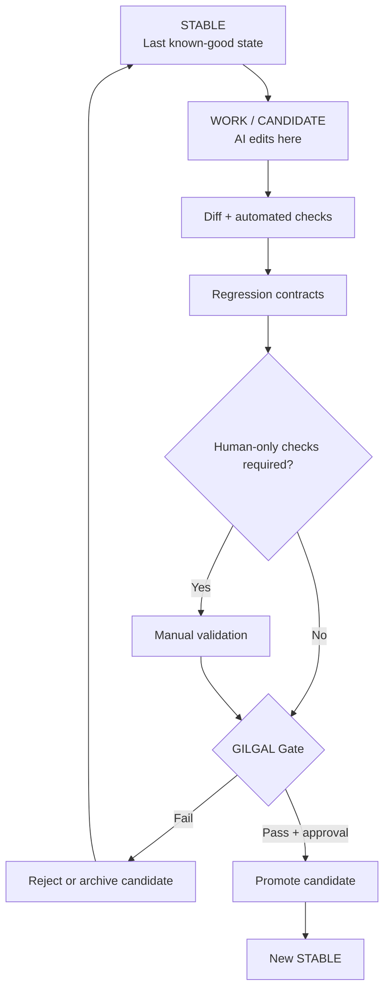

# GILGAL

**Guarded Iterative Layer for Generative Agent Logic**

A safety workflow for AI coding agents: **never destroy the last known-good version while trying to create the next one.**

> **Core rule:** STABLE is never the laboratory. WORK is the laboratory.

**Concept documented by:** David Ferreira ([@crentefiel](https://github.com/crentefiel))  
**First public specification:** 2026-08-25  
**Current concept version:** 0.1.0

---

## Português

O **GILGAL** é um protocolo de trabalho para agentes de IA que programam software.

A ideia central é simples: manter **dois ambientes separados**.

- **STABLE** — última versão comprovadamente funcional.
- **WORK** — ambiente onde a IA pode editar, experimentar e corrigir.

A IA nunca deve usar STABLE como laboratório.

```text
STABLE
  │
  ├── cria CANDIDATE / WORK
  │
  ▼
WORK
  │
  ├── alterações
  ├── diff
  ├── typecheck
  ├── testes
  ├── build
  ├── contratos de regressão
  └── testes humanos quando necessários
  │
  ▼
GILGAL GATE
  │
  ├── FAIL  → STABLE permanece intacto
  │
  └── PASS  → candidato pode ser promovido
```

Se a tentativa falhar, a versão funcional anterior continua preservada e pode ser usada como **memória executável** para comparar o que mudou.

O GILGAL não tenta substituir Git, branches, worktrees, CI ou testes. Ele organiza esses mecanismos em um protocolo específico para agentes de IA.

---

## English

**GILGAL** is a guarded development protocol for AI coding agents.

Its central idea is to keep the last verified version physically/logically protected while the AI works in an isolated candidate environment.



## Why GILGAL?

AI coding agents are fast, but a local fix can accidentally break an older behavior that was already working. A successful build does not prove that the application still behaves correctly.

GILGAL changes the default question from:

> “Did the new code compile?”

into:

> “Did the candidate preserve the verified behavior of the stable version?”

## Core principles

1. **Protect the last known-good state.**
2. **AI edits happen only in WORK/CANDIDATE.**
3. **The previous working code is part of the agent's memory.**
4. **Diff before guessing when a regression appears.**
5. **Automated checks are necessary, but not sufficient.**
6. **Physical or real-world checks cannot be self-approved by the agent.**
7. **Promotion is explicit and gated.**
8. **Failed candidates may be preserved for diagnosis instead of overwriting history.**

## Suggested implementation

A practical implementation can use:

- Git branches
- Git worktrees
- automated typecheck/tests/build
- regression contracts
- CI checks
- manual approval gates
- tags or commits for rollback points

Example layout:

```text
project/                 ← STABLE
project-GILGAL-WORK/     ← WORK / CANDIDATE
```

The folders are conceptually separate, while Git can share repository history and objects efficiently.

## Promotion invariant

A candidate **MUST NOT** replace STABLE if any required gate fails.

```text
STABLE works
CANDIDATE fails
        ↓
REGRESSION DETECTED
        ↓
PROMOTION BLOCKED
        ↓
STABLE remains untouched
```

## Human gate

Some behaviors cannot be proven by source code or CI alone, for example:

- physical printing
- hardware integration
- a real login/session with an external service
- installation on another machine
- visual or operational acceptance

In those cases, the AI may report **PENDING**, but it must not mark the test as passed on its own.

## Memory by executable history

Documentation helps an AI understand *why* the system exists.

GILGAL adds something stronger: the last working implementation remains available to answer *how it worked when it was correct*.

When a regression appears, the agent can compare:

```text
KNOWN-GOOD STABLE
        VS
BROKEN CANDIDATE
```

That makes the working code itself part of the project's memory.

## Documents

- [GILGAL.md](GILGAL.md) — concept, origin and principles
- [SPECIFICATION.md](SPECIFICATION.md) — normative workflow and state transitions
- [CHANGELOG.md](CHANGELOG.md) — concept history

## Scope and prior art note

Git branches, worktrees, CI, staging environments, rollback strategies and promotion gates are established software-engineering mechanisms.

**GILGAL is the name used here for the specific protocol that combines protected STABLE state, isolated AI WORK state, executable-memory comparison, regression contracts, promotion gates, and human-only validation for real-world tests.**

This repository documents the concept and its evolution. It does not make a claim of patent status or worldwide novelty.

---

## Status

**GILGAL 0.1.0 — initial public concept specification.**

Feedback, experiments and reference implementations are welcome.