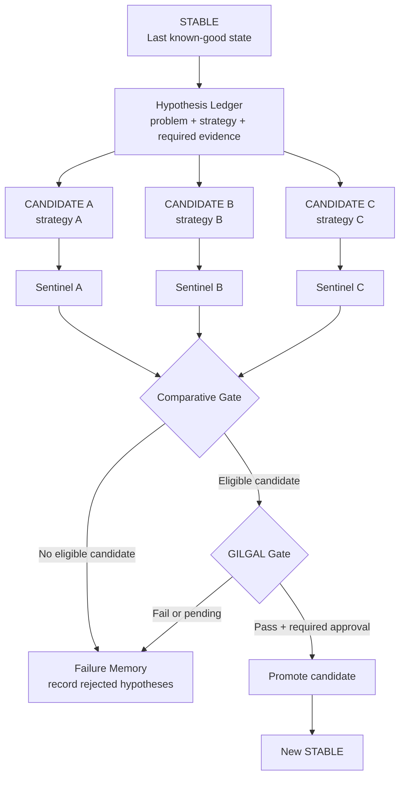

# GILGAL

**Guarded Iterative Layer for Generative Agent Logic**

A safety workflow for AI coding agents: **never destroy the last known-good version while trying to create the next one.**

> **Core rule:** STABLE is never the laboratory. WORK is the laboratory.

[](https://github.com/crentefiel/gilgal-ai-workflow/actions/workflows/sentinel-ci.yml)
[](https://github.com/crentefiel/gilgal-ai-workflow/actions/workflows/gilgal-policy-gate.yml)

## The problem in 20 seconds

An AI coding agent fixes duplex printing—but silently breaks WhatsApp and file reception. Tests for printing are green. Is the new version better?

```text
STABLE  → WhatsApp PASS | File reception PASS | Duplex FAIL
WORK    → WhatsApp FAIL | File reception FAIL | Duplex PASS
GILGAL  → NO WINNER → build a Reconciliation Candidate
```

GILGAL protects the last verified state, remembers failed strategies, evaluates behavior by capability, and blocks promotion when a candidate improves one area by regressing another.

> **Do not promote the candidate that fixed one thing. Reconstruct the candidate that preserves everything proven and imports only the verified improvement.**

### What makes it different

- **Capability-aware:** compares observable behavior, not only commits or test totals.
- **Evidence-bound:** every claim belongs to an exact SHA, environment and proof type.
- **Human-safe:** AI cannot self-approve physical or real-world evidence.
- **Failure-aware:** rejected strategies become memory instead of being silently repeated.
- **Reconciliation-first:** `NO_WINNER` creates a clean path from STABLE instead of selecting the least-bad candidate.
- **Executable:** Sentinel, CUE schemas and OPA policies turn protocol rules into CI decisions.

**Start here:** [GILGAL 0.5 capability reconciliation](GILGAL_0_5_CAPABILITY_RECONCILIATION.md) · [Evidence & Policy Engine](policy/README.md) · [Influences and prior art](INFLUENCES_AND_PRIOR_ART.md)


**Concept documented by:** David Ferreira ([@crentefiel](https://github.com/crentefiel))  
**First public specification:** 2026-08-25  
**Current concept version:** 0.4.0

---

## Português

O **GILGAL** é um protocolo de trabalho para agentes de IA que programam software.

A ideia central é manter o último estado comprovadamente bom protegido enquanto a IA trabalha em candidatos isolados — e, a partir da versão 0.4.0, também impedir que uma hipótese já rejeitada continue sendo repetida silenciosamente em novas tentativas.

- **STABLE** — última versão comprovadamente funcional.
- **WORK / CANDIDATE** — ambiente onde a IA pode editar, experimentar e corrigir.
- **SENTINEL** — reúne evidências, executa verificações e procura regressões.
- **GATE** — bloqueia promoção quando os requisitos não foram comprovados.
- **FAILURE MEMORY** — registra hipóteses e estratégias rejeitadas.
- **HYPOTHESIS LEDGER** — torna o histórico da investigação explícito.
- **BRANCHING / DIVERGENCE** — separa estratégias concorrentes a partir da mesma base STABLE.

A IA nunca deve usar STABLE como laboratório.

```text
                    STABLE
                      │
              definir problema
                      │
              Hypothesis Ledger
                      │
        ┌─────────────┼─────────────┐
        │             │             │
   CANDIDATE A   CANDIDATE B   CANDIDATE C
   strategy A    strategy B    strategy C
        │             │             │
     Sentinel      Sentinel      Sentinel
        └─────────────┼─────────────┘
                      │
              COMPARATIVE GATE
                      │
               best verified path
                      │
                 GILGAL GATE
                      │
                  HUMAN CHECK
                      │
                  NEW STABLE
```

Se uma tentativa falhar, STABLE permanece intacto. Se uma hipótese falhar, essa decisão também pode ser preservada como **Failure Memory**, para impedir que a IA apenas renomeie a mesma estratégia e tente novamente sem nova evidência.

> **Executable Memory remembers what worked. Failure Memory remembers what must not be repeated.**

O GILGAL não tenta substituir Git, branches, worktrees, CI ou ferramentas de teste. Ele organiza esses mecanismos em um protocolo específico para agentes de IA.

### Regression Replay

Desde 0.3.0, o GILGAL recomenda transformar bugs já encontrados e corrigidos em contratos reproduzíveis.

> **Every regression should become a contract.**

Assim, um erro antigo deixa de ser apenas história e passa a ser um teste que futuros candidatos precisam enfrentar novamente.

### Change Budget

O GILGAL também pode impor um orçamento explícito de mudança. Uma tarefa pequena que altera arquivos ou linhas demais pode gerar:

```text
SCOPE EXPANSION DETECTED
```

Isso não significa automaticamente que uma mudança grande está errada. Significa que uma expansão inesperada de escopo precisa ser revisada antes de substituir STABLE.

### Failure Memory e Hypothesis Ledger

A versão 0.4.0 adiciona uma proteção para um problema diferente: a IA pode preservar STABLE corretamente e, ainda assim, ficar presa em uma mesma hipótese ruim.

Exemplo do que evitar:

```text
STABLE
↓
WORK v1 com hipótese errada
↓
WORK v2 herdando v1
↓
WORK v3 herdando v2
↓
mais workarounds, mesma estratégia
```

Nova regra:

> **A failed hypothesis must not silently become the foundation of the next hypothesis.**

Uma investigação difícil SHOULD registrar hipótese, família de estratégia, experimento, evidência necessária e resultado. Uma estratégia rejeitada pode ser marcada como **EXHAUSTED** e não deve receber outra tentativa sem nova evidência ou reabertura explícita.

Veja [HYPOTHESIS_LEDGER.md](HYPOTHESIS_LEDGER.md).

---

## English

**GILGAL** is a guarded development protocol for AI coding agents.

Its central idea is to keep the last verified version protected while the AI works in isolated candidate environments. Version 0.4.0 extends this with decision memory so rejected hypotheses do not silently become the basis of later attempts.



## Why GILGAL?

AI coding agents are fast, but a local fix can accidentally break older behavior or become trapped in an incorrect debugging strategy. A successful build does not prove that the application still behaves correctly, and repeated patches do not prove that the underlying hypothesis is valid.

GILGAL changes the default questions from:

> “Did the new code compile?”

and:

> “Can I patch this attempt again?”

into:

> “Did the candidate preserve the verified behavior of STABLE?”

and:

> “Is this genuinely new evidence or am I repeating a rejected strategy?”

## GILGAL Sentinel

**GILGAL SENTINEL** is the verification layer introduced in protocol 0.2.0.

It may combine:

- code/type/static checks;
- automated tests;
- STABLE vs CANDIDATE regression comparison;
- Regression Replay for previously fixed bugs;
- Change Budget evidence for scope expansion;
- runtime/log analysis;
- human-only validation gates;
- Failure Memory and Hypothesis Ledger evidence when supported by the implementation.

Sentinel is tool-agnostic. It may consume results from TestSprite, Playwright, Vitest, Jest, pytest, CI systems, or other test engines.

A critical contract failing in CANDIDATE while passing in STABLE must block promotion.

### Reference implementation

This repository includes **GILGAL Sentinel Reference Implementation 0.2.0** in [`sentinel/`](sentinel/README.md). Its implementation version is independent from the GILGAL protocol version.

The local TypeScript CLI resolves STABLE/CANDIDATE Git evidence, runs configured checks, evaluates `command`, `manual`, and `replay` contracts, compares exact-SHA baselines, enforces an optional Change Budget, writes JSON/Markdown reports, and returns CI-compatible gate exit codes. It never promotes code or mutates STABLE.

The 0.2.0 reference implementation does not yet automatically enforce every Failure Memory rule from protocol 0.4.0. Those rules are already part of the protocol and may be applied manually or by future Sentinel implementations.

## Regression Replay

A previously fixed regression can be encoded as a replay contract and run on every future candidate.

```text
bug discovered
    ↓
fix verified
    ↓
replay contract recorded
    ↓
future candidate
    ↓
old failure condition replayed
```

If STABLE records `PASS` and CANDIDATE returns `FAIL`, Sentinel reports a regression and blocks the Gate when that replay is critical.

## Change Budget

A project may configure explicit limits for candidate scope, such as:

- changed files;
- insertions;
- deletions;
- total changed lines.

When a critical budget is exceeded, Sentinel reports `SCOPE EXPANSION DETECTED` and blocks promotion until the change is reduced or the policy is deliberately revised.

## Failure Memory

Failure Memory preserves rejected or inconclusive reasoning paths as auditable decision evidence.

> **A failed hypothesis must not silently become the foundation of the next hypothesis.**

A Candidate Family groups attempts that test the same underlying strategy. A family may be marked **EXHAUSTED** when the available evidence rejects that strategy. An AI agent must not silently reopen an exhausted family merely by renaming the implementation.

## Hypothesis Ledger

For difficult debugging, repeated failures, or problems without a known-good implementation, a project should record:

```text
problem id
hypothesis id
strategy family
claim
experiment
required evidence
candidate reference
result
supporting evidence
```

Recommended states:

```text
ACTIVE
CONFIRMED
REJECTED
INCONCLUSIVE
```

The ledger is evidence metadata, not executable instructions.

## Comparative Gate

When multiple candidates test different strategies, GILGAL may compare them using a Comparative Gate.

The Comparative Gate does not choose the "least bad" candidate. Every candidate must satisfy its own critical evidence. If none do, there is no winner and STABLE remains unchanged.

## Core principles

1. **Protect the last known-good state.**
2. **AI edits happen only in WORK/CANDIDATE.**
3. **The previous working code is part of the agent's memory.**
4. **Diff before guessing when a regression appears.**
5. **Automated checks are necessary, but not sufficient.**
6. **Physical or real-world checks cannot be self-approved by the agent.**
7. **Promotion is explicit and gated.**
8. **Failed candidates may be preserved for diagnosis instead of overwriting history.**
9. **Sentinel compares verified STABLE behavior against CANDIDATE behavior.**
10. **Previously fixed regressions should become replayable contracts when reproducible.**
11. **Unexpected scope expansion should be made visible before promotion.**
12. **Rejected hypotheses should become Failure Memory when relevant.**
13. **Competing hypotheses should branch from the same STABLE base whenever practical.**
14. **An exhausted strategy must not be silently repeated without new evidence or explicit reopening.**
15. **A Comparative Gate must return no winner when no candidate satisfies critical requirements.**

## Suggested implementation

A practical implementation can use:

- Git branches
- Git worktrees
- parallel candidate branches for competing hypotheses
- automated typecheck/tests/build
- regression contracts
- Regression Replay
- Change Budget
- Hypothesis Ledger records
- Failure Memory
- CI checks
- manual approval gates
- tags or commits for rollback points
- optional external QA/test engines

Example layout:

```text
project/                              ← STABLE
project-GILGAL-WORK-A/                ← hypothesis A
project-GILGAL-WORK-B/                ← hypothesis B
```

The folders are conceptually separate, while Git can share repository history and objects efficiently.

## Promotion invariant

A candidate **MUST NOT** replace STABLE if any required gate fails.

```text
STABLE protected
CANDIDATE fails
        ↓
GILGAL SENTINEL
        ↓
PROMOTION BLOCKED
        ↓
Failure Memory records why
        ↓
new hypothesis branches from STABLE
```

## Human gate

Some behaviors cannot be proven by source code or CI alone, for example:

- physical printing
- hardware integration
- a real login/session with an external service
- installation on another machine
- visual or operational acceptance

In those cases, the AI may report **PENDING**, but it must not mark the test as passed on its own.

## Memory model

GILGAL now distinguishes several forms of memory:

```text
Executable Memory
  what worked in STABLE

Regression Replay
  how a previously fixed bug can be reproduced

Failure Memory
  which hypotheses or strategies were rejected and why
```

Together:

```text
what worked
+
what failed
+
why a strategy was rejected
+
how to prove the regression did not return
```

## GILGAL 0.5 protocol candidate

A capability-aware evolution is under review. It adds Capability Ledger, Preservation Baseline, Regression Quarantine, Composite `NO_WINNER`, Capability Transplant and Reconciliation Candidates.

The candidate also proposes Transplant Manifests, a Capability Dependency Graph, a Blast-Radius Gate, evidence provenance/taint rules, shadow validation and confidence-aware revalidation.

This is a protocol proposal. The current Sentinel 0.2.0 reference implementation does not yet enforce these rules automatically.

See [GILGAL 0.5 Capability-Aware Reconciliation](GILGAL_0_5_CAPABILITY_RECONCILIATION.md).

## Evidence & Policy Engine prototype

The GILGAL 0.5 candidate now has an executable policy prototype using CUE schemas and an OPA capability Gate. It also includes a manual GitHub-attested Sentinel build workflow.

This is a prototype, not a claim that every GILGAL 0.5 rule is implemented. See [policy/README.md](policy/README.md).

GILGAL explicitly acknowledges the technologies and research that influenced its synthesis. See [Influences and Prior Art](INFLUENCES_AND_PRIOR_ART.md).

## Documents

- [GILGAL.md](GILGAL.md) — concept, origin and principles
- [HYPOTHESIS_LEDGER.md](HYPOTHESIS_LEDGER.md) — Failure Memory, Candidate Families, Strategy Exhaustion and Branching
- [SENTINEL.md](SENTINEL.md) — verification and regression-detection layer
- [SPECIFICATION.md](SPECIFICATION.md) — normative workflow and state transitions
- [CHANGELOG.md](CHANGELOG.md) — concept history
- [sentinel/README.md](sentinel/README.md) — Sentinel 0.2.0 installation, CLI, configuration and security

## Scope and prior art note

Git branches, worktrees, CI, staging environments, rollback strategies, promotion gates, parallel experiment branches and automated testing are established software-engineering mechanisms.

**GILGAL is the name used here for the specific protocol that combines protected STABLE state, isolated AI WORK state, executable-memory comparison, regression contracts, Sentinel verification, promotion gates, human-only validation, Regression Replay, explicit change-scope budgeting, Failure Memory, Hypothesis Ledger, Candidate Families, Strategy Exhaustion, Branching/Divergence, and Comparative Gate.**

This repository documents the concept and its evolution. It does not make a claim of patent status or worldwide novelty.

---

## Status

**GILGAL protocol 0.4.0 + GILGAL Sentinel reference implementation 0.2.0.**

Feedback, experiments and reference implementations are welcome.
